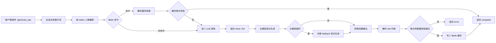

# Ads Generator

一个基于 FastAPI 的广告文案生成服务，核心能力是：
- 接收产品信息与目标受众
- 调用 LLM 生成多条广告文案
- 使用 Redis 做结果缓存
- 通过 SSE（Server-Sent Events）流式返回生成过程与结果

## 1. 项目目标

该服务面向“营销文案自动生成”场景，目标是在低延迟下稳定返回结构化结果（JSON 中的 ads 列表），并尽量减少重复请求带来的 LLM 成本。

## 2. 业务流程（核心）



## 3. 请求与响应设计

### 3.1 请求体

接口：`POST /generate_ads`

```json
{
  "product": "智能运动手表",
  "audience": "25-35 岁健身人群",
  "num_ads": 3
}
```

字段说明：
- `product`: 产品名称
- `audience`: 目标受众
- `num_ads`: 需要生成的广告条数（必须大于 0）

### 3.2 SSE 响应事件

服务返回 `text/event-stream`，主要事件类型：
- `meta`: 数据来源信息（`cache` 或 `llm`）
- `delta`: LLM 流式片段
- `complete`: 最终广告结果
- `error`: 错误信息

事件示例：

```text
event: meta
data: {"source":"llm"}

event: delta
data: {"content":"{\"ads\":[\"..."}

event: complete
data: {"ads":["文案1","文案2","文案3"]}
```

## 4. 模块职责

- `main.py`
  - FastAPI 应用入口
  - `/generate_ads` 主流程
  - SSE 事件编排与响应输出
- `config.py`
  - 环境变量读取
  - LLM 与 Redis 配置定义
- `prompts.py`
  - 系统提示词与用户提示词模板
- `static/index.html`
  - 手工验证页面（输入参数并查看广告生成结果）
- `utils/llm.py`
  - LLM 调用与 fallback 逻辑
  - Redis 缓存读写
  - 输出解析与 token 截断
- `utils/log.py`
  - 统一日志初始化
  - 结构化日志输出与异常日志
- `requirements.txt`
  - 运行依赖

## 5. 缓存与降级策略

### 5.1 Redis 缓存

缓存键由 `prompt + model` 的 SHA-256 组成。

价值：
- 相同请求可快速返回
- 降低 LLM 请求次数与成本

### 5.2 模型降级

当主模型超时：
- 自动切换到 fallback 模型
- 流式接口与非流式逻辑都包含降级路径

## 6. 配置项（环境变量）

关键配置（可参考 `.env.example`）：
- `OPENAI_API_KEY`
- `PRIMARY_LLM_MODEL`
- `FALLBACK_LLM_MODEL`
- `LLM_TIMEOUT_SECONDS`
- `MAX_INPUT_TOKENS`
- `MAX_OUTPUT_TOKENS`
- `REDIS_HOST`
- `REDIS_PORT`
- `REDIS_DB`
- `REDIS_TTL_SECONDS`

注意：
- 不要把真实密钥写入仓库
- `.env` 已被 `.gitignore` 忽略

## 7. 本地运行

### 7.1 安装依赖

```bash
pip install -r requirements.txt
```

### 7.2 准备环境变量

```bash
cp .env.example .env
# 然后编辑 .env，填入 OPENAI_API_KEY
```

### 7.3 启动 Redis

确保本机可访问 Redis（默认 `localhost:6379`）。

### 7.4 启动服务

```bash
uvicorn main:app --reload
```

启动后可访问：
- 首页验证页：`http://127.0.0.1:8000/`
- 静态验证页：`http://127.0.0.1:8000/static/index.html`
- Swagger 文档：`http://127.0.0.1:8000/docs`
- OpenAPI：`http://127.0.0.1:8000/openapi.json`

### 7.5 通过 `/static/index.html` 验证广告生成效果

1. 打开：`http://127.0.0.1:8000/static/index.html`
2. 填写三个入参：`product`、`audience`、`num_ads`
3. 点击“提交”
4. 在页面下方 `Output` 文本框查看生成结果

说明：
- 页面会调用 `POST /generate_ads` 接口
- 输出会先展示流式片段，接口完成后显示最终广告列表

## 8. 异常与可观测性

- 结构化日志：以 JSON 字段记录关键事件
- 常见错误：
  - `OPENAI_API_KEY` 未配置
  - LLM 返回非预期 JSON
  - 返回 ads 数量少于请求数量
  - Redis 不可用（会记录异常，流程尽量继续）

## 9. 当前已知限制

- 输出强依赖模型遵循 JSON 格式
- 暂未提供鉴权与限流
- 无单元测试与集成测试

## 10. 后续建议

- 增加接口鉴权（如 API Token）
- 增加请求限流与熔断
- 增加测试：
  - 输出解析单元测试
  - 缓存命中/未命中路径测试
  - 主模型超时后的 fallback 测试
